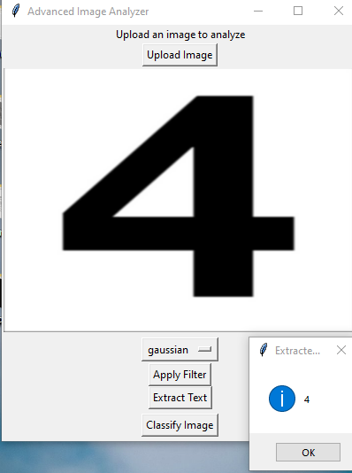
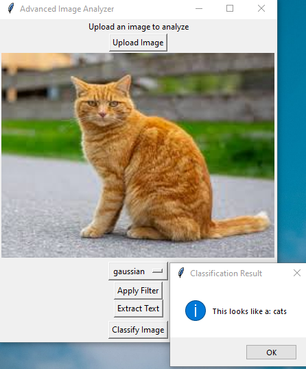

# Advanced_Image_Analyzer_with_ML
Advanced Image Analyzer is a Python desktop application that performs image processing, feature extraction, OCR, and basic image classification.

Features:

1) Image Processing & Enhancement

Convert images to grayscale

Apply filters: Sobel (edge detection), Gaussian blur, Sharpen

Contrast enhancement and denoising

2) OCR (Text Extraction)

Extract text from images using pytesseract

Save or view extracted text in the application

3) Machine Learning

Basic image classification using scikit-learn (Random Forest)

Supports multiple categories of images

Train, evaluate, and save the model

4) Interactive GUI

Tkinter-based desktop app

Upload images and visualize results

Apply filters and extract text with a single click

Tech Stack:

-Python 3.8+

-Image Processing: scikit-image, OpenCV, Pillow

-OCR: pytesseract

-Machine Learning: scikit-learn

-GUI: Tkinter

-Numerical & Visualization: numpy, matplotlib

Usage:
1) download images: python download_images.py
2) training: python training.py
3) test prediction: predict.py
4) python main.py
   
   Click "Upload Image" and select an image.
   
   Select a filter from the dropdown and click "Apply Filter" to see the effect.
   
   Click "Extract Text" to read text or numbers from the image.
   
   Click "Classify Image" to predict the class (e.g., Cat/Dog) using ML model.

